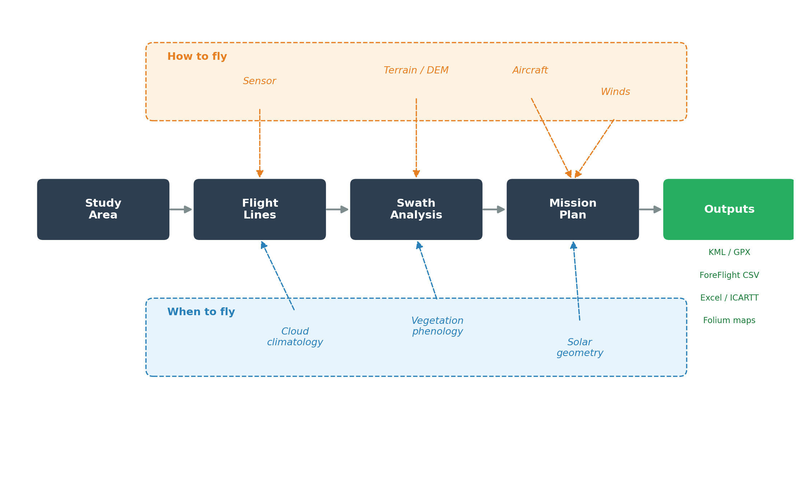
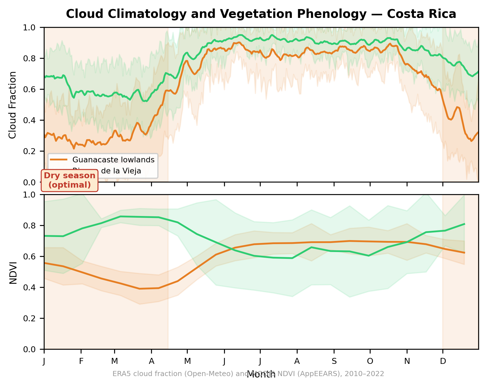

# Summary

Airborne remote sensing is a critical tool for Earth science, enabling observations at spatial and temporal scales that bridge ground-based measurements and satellite data. Airborne platforms carry imaging spectrometers, lidars, radars, and other instruments over study areas at altitudes ranging from a few hundred meters to over 20 kilometers, producing data products across Earth science disciplines. Planning these campaigns, however, requires integrating a diverse set of constraints: aircraft performance envelopes, sensor geometry and ground sampling requirements, solar illumination conditions, terrain variability, cloud climatology, airport logistics, and coordination with satellite overpasses. Scientists typically address these constraints using ad hoc spreadsheets, manual calculations, and institutional knowledge, resulting in workflows that are error-prone, difficult to reproduce, and hard to transfer between campaigns or research groups.

HyPlan is an open-source Python library that provides a unified, reproducible framework for planning airborne remote sensing missions. It encodes the physics of sensor-platform-environment interactions into composable building blocks that can be combined to design, evaluate, and optimize flight campaigns. HyPlan supports the full mission planning lifecycle: from defining study areas and generating flight line patterns, through sensor swath and ground sample distance calculations, to computing complete mission plans with multi-day scheduling and flight line ordering optimization. The library ships with pre-configured models for 15 NASA research instruments and 14 research aircraft, and provides tools for solar geometry analysis, terrain-aware swath modeling, cloud climatology assessment, airport selection, and satellite overpass prediction.

A key technical contribution is terrain-aware swath modeling using ray--surface intersection, which captures terrain-induced variations in swath width and position that flat-Earth approximations miss. This capability can be substantial in mountainous regions, where swath width may vary by hundreds of meters along a single flight line.

# Statement of Need

Airborne science campaigns represent major investments of resources, often costing millions of dollars and requiring months of coordination among scientists, pilots, instrument teams, and logistics personnel. A single deployment of a high-altitude aircraft such as the NASA ER-2 can cost tens of thousands of dollars per flight hour, and campaigns typically span weeks to months of field operations. Despite these costs, the flight planning process has remained largely manual and fragmented across disconnected tools.

Scientists planning airborne campaigns must simultaneously reason about several interacting domains:

**Sensor performance.** The ground sample distance (GSD) of a pushbroom imaging spectrometer depends on altitude above ground level, the sensor's instantaneous field of view, and the ratio of aircraft ground speed to sensor frame rate. For a given sensor, the critical ground speed is the maximum speed at which along-track pixels remain contiguous. Swath width determines how many parallel flight lines are needed to cover a study area, and the required overlap between adjacent swaths depends on both the science requirements and the terrain relief, which causes swath width to vary along a flight line. Planning must account for these relationships to ensure that the collected data meet the spatial sampling requirements of the intended science application.

**Solar geometry.** Most passive optical and spectroscopic instruments require minimum solar elevation angles for adequate signal-to-noise ratios. For aquatic remote sensing, sun glint---specular reflection of sunlight from the water surface into the sensor's field of view---can contaminate observations or, in some applications, provide useful information about surface roughness [@cox1954glint]. The glint angle depends on solar position, sensor view geometry, and flight heading, and varies continuously along a flight line. Planning must identify time windows that satisfy both minimum illumination and glint avoidance (or targeting) constraints.

**Logistics.** Aircraft have finite endurance, and research aircraft often operate from airports with specific runway length or surface requirements. A campaign covering a large study area may require hundreds of flight lines that cannot be completed in a single sortie. The ordering of flight lines, selection of refueling airports, and allocation of lines to flight days all affect total campaign duration and cost. These combinatorial logistics problems interact with the time-varying solar constraints described above.

**Satellite coordination.** Many airborne campaigns are designed to collect coincident or near-coincident observations with satellite instruments for calibration, validation, or science synergy. Planning must predict satellite overpass times and ground-track geometry to identify windows of overlap.

No existing open-source tool addresses these questions in an integrated, programmatic manner. HyPlan fills this gap by providing a Python library that models the full chain of constraints relevant to airborne remote sensing mission planning.

# State of the Field

Several categories of tools address subsets of the airborne mission planning problem, but none provide an integrated, scriptable solution for science-driven flight planning.

**Commercial flight planning software.** Tools such as ForeFlight and Jeppesen FliteStar focus on pilot navigation, fuel planning, and regulatory compliance for general and commercial aviation. These tools are not designed to reason about scientific objectives such as ground sample distance, spectral coverage, solar geometry, or sensor-specific swath overlap requirements.

**Geographic information systems.** GIS platforms such as QGIS and ArcGIS can visualize flight lines and study areas, but lack domain-specific calculations for sensor modeling, aircraft performance, and mission timing. While scientists often use GIS tools to display planned flight tracks, the underlying planning calculations must be performed elsewhere.

**UAS mission planners.** In the unmanned aerial systems domain, tools such as Mission Planner and QGroundControl [@qgroundcontrol] provide waypoint planning and autopilot integration. However, these are designed for small drones operating at low altitudes and short ranges, and do not model the sensor physics, solar geometry, or logistics constraints relevant to crewed research aircraft operating over large study areas at high altitudes.

**Moving Lines.** The most directly comparable tool is Moving Lines [@leblanc2018movinglines], a Python-based flight planning application developed for NASA airborne science campaigns. Moving Lines provides a graphical user interface combining an interactive map with spreadsheet-based waypoint editing and has been used operationally across numerous NASA field campaigns including ORACLES, IMPACTS, and ARCSIX. Moving Lines excels at real-time, interactive flight plan creation and modification during campaign operations, with features for overlaying satellite imagery, weather model output, and satellite ground tracks.

However, Moving Lines is designed as a GUI application for manual, interactive planning rather than as a programmatic library. It does not provide sensor-specific swath and GSD calculations, terrain-aware analysis, automated flight line generation from study area polygons, or algorithmic flight line ordering optimization. HyPlan and Moving Lines are complementary: HyPlan addresses the pre-campaign science planning phase---determining how many flight lines are needed, what altitude and speed satisfy sensor requirements, when solar conditions permit data collection, and how to schedule lines across multiple flight days---while Moving Lines supports the tactical, day-of-flight planning and replanning that occurs during campaign execution.

**Agency-internal tools.** Various NASA centers and other research organizations have developed internal flight planning tools tailored to specific instruments or aircraft, but these are typically proprietary, undocumented, and tightly coupled to particular missions, making them difficult to adapt to new campaigns or share across the research community.

HyPlan is, to our knowledge, the first open-source library that integrates sensor modeling, flight planning, environmental analysis, and logistics optimization for airborne remote sensing in a single, composable Python framework.

# Typical Workflow

A typical HyPlan workflow proceeds through five stages (\autoref{fig:workflow}), each represented by a few lines of Python:

1. **Define the study area.** The user specifies one or more study polygons as GeoJSON or shapefiles, or provides center coordinates and dimensions.

2. **Generate flight lines.** Given a sensor, altitude, and desired overlap, `box_around_center_line` or `box_around_polygon` distributes parallel lines to cover the study area, alternating direction to minimize transit time.

3. **Compute terrain-aware swaths.** `generate_swath_polygon` traces rays from the sensor through the atmosphere to the terrain surface using 30 m Copernicus DEM data, producing swath polygons that account for terrain-induced variations in ground coverage.

4. **Add winds and compute the mission plan.** `compute_flight_plan` models the full sortie---takeoff, climb, transit, data collection, descent, and approach---using an aircraft performance model and, optionally, wind fields from MERRA-2 reanalysis, GEOS-FP analysis, or GFS forecasts. The planner computes segment-by-segment timing, crab angles, and ground speed.

5. **Export artifacts.** The resulting flight plan exports to formats consumed by pilots (ForeFlight CSV, Honeywell FMS), science teams (Excel, ICARTT), and GIS tools (KML, GPX, GeoJSON), and can be rendered as interactive Folium web maps.

Because every step is a Python function call, the entire workflow is version-controllable, parameterizable, and reproducible---replacing the ad hoc spreadsheets and manual calculations that have traditionally characterized airborne mission planning.

# Software Design

HyPlan is organized into three functional groups---Flight Planning, Instruments, and Environment and Logistics---each containing several modules. The library is built on the scientific Python ecosystem, using NumPy [@harris2020numpy] for numerical operations, pandas [@mckinney2010pandas], GeoPandas [@jordahl2020geopandas], and Shapely [@gillies2007shapely] for geospatial data structures, and pymap3d [@hirsch2018pymap3d] and pyproj [@pyproj] for coordinate transformations and geodesic calculations.

Several cross-cutting design decisions shape how these modules are implemented and used. All physical quantities carry explicit units via the Pint library [@pint], preventing the class of unit conversion errors that has historically caused failures in aerospace applications [@mco1999] and supporting seamless mixing of aviation conventions (feet, knots, nautical miles) with scientific conventions (meters, m/s, kilometers). All distance and bearing calculations use Vincenty's inverse and direct formulae [@vincenty1975direct] on the WGS84 ellipsoid via the `pymap3d` library, avoiding the errors inherent in spherical approximations, which can exceed 0.3% for distances relevant to airborne surveys. Rather than providing a monolithic GUI application, HyPlan exposes its functionality through a composable Python API that can be used in scripts, Jupyter notebooks, and automated pipelines. Results export to standard geospatial and aviation formats (GeoJSON, KML, ForeFlight CSV, Honeywell FMS, ICARTT, GPX, Excel) and render as interactive Folium web maps [@folium] for immediate visual feedback.

## Flight Planning

The core abstraction in HyPlan is the `FlightLine`, which represents a geodesic flight segment defined by two geographic endpoints and an altitude above mean sea level. Flight lines support a rich set of geometric operations: clipping to polygon boundaries, splitting into segments of specified length, perpendicular and along-track offsetting, rotation around the midpoint, and reversal of flight direction. Each operation preserves the geodesic properties of the line and maintains altitude and metadata.

The `FlightBox` module generates arrays of parallel flight lines covering arbitrary study areas. Given a sensor, altitude, and desired cross-track overlap, the module computes the swath spacing and distributes lines symmetrically around a center line or across a study polygon. Lines can be oriented along a user-specified azimuth or automatically aligned with the minimum rotated bounding rectangle of the study area. An alternating-direction (boustrophedon) option produces a serpentine pattern that minimizes transit time between adjacent lines. When a clipping polygon is provided, lines are clipped to the study area boundary, with small gaps from coastline or boundary concavities automatically merged to prevent line fragmentation.

Beyond parallel survey lines, the `flight_patterns` module provides generators for specialized sampling geometries including racetrack patterns, rosettes, sawtooth profiles, spirals, and coordinated multi-aircraft lines. These patterns are used for instrument calibration, atmospheric profiling, and other applications where simple parallel coverage is insufficient.

\autoref{fig:flightbox} illustrates the spatial planning pipeline for a survey of Rinc\'{o}n de la Vieja National Park in Costa Rica using AVIRIS-3 at 20,000 ft MSL: (a) the study area over shaded relief showing terrain from 0 to 2,017 m elevation, (b) the minimum rotated bounding rectangle with sensor-driven line spacing, (c) flight lines with terrain-aware spacing that adapts to local elevation, and (d) lines clipped to the park boundary with terrain-aware swath polygons (described in the Instruments section below) showing ground coverage narrowing over the volcano summit where the aircraft is closer to the terrain.

Complete mission plans are computed by the `flight_plan` module, which models each phase of a sortie: takeoff and initial climb from the departure airport, transit to the first flight line, data collection segments along each flight line, transit between lines, descent, approach, and landing at the destination airport. Each phase uses the aircraft's altitude-dependent speed profile, and the module computes segment-by-segment timing, distance, heading, and altitude. The output is a GeoDataFrame containing the full flight trajectory with segment classification, which can be visualized as altitude profiles and interactive maps.

For campaigns with many flight lines, the `flight_optimizer` module formulates line ordering as a graph problem. Nodes in a NetworkX [@hagberg2008networkx] directed graph represent airport locations and flight line endpoints; edges are weighted by transit time, computed from Dubins path distances and aircraft performance models including climb and descent. The optimizer applies a greedy nearest-neighbor heuristic subject to constraints on aircraft endurance, maximum daily flight time, and the availability of refueling airports. When endurance is exhausted, the optimizer identifies the nearest airport from which at least one additional unvisited flight line is reachable, routes the aircraft for refueling, and continues. The result is a multi-day schedule with ordered flight lines, refueling stops, and per-day flight time accounting. While the greedy algorithm does not guarantee global optimality, it produces practical schedules efficiently and can serve as a starting point for further manual refinement.

Realistic aircraft maneuvering between waypoints is modeled using Dubins curves [@dubins1957curves; @walker2011dubins], which compute the shortest path between two oriented points (position plus heading) subject to a minimum turning radius constraint. \autoref{fig:dubins} shows a complete mission from Liberia airport (MRLB) to the Rinc\'{o}n de la Vieja flight lines and back, comparing still-air and wind-perturbed trajectories. The turning radius is derived from the aircraft's speed and maximum bank angle as $R = v^2 / (g \tan\phi)$, where $v$ is true airspeed, $g$ is gravitational acceleration, and $\phi$ is the bank angle. In still air, Dubins paths consist of combinations of circular arcs and straight segments. When wind is present, the circular arcs become trochoidal ground tracks---circles drifting with the wind---following the approach of Sachdev et al. [@sachdev2023trochoid]. The solver finds the time-optimal path in the air-relative frame and then maps it to ground coordinates, where the wind drift distorts the turning geometry. This also produces crab angles---the offset between aircraft heading and ground track---that affect both mission timing and the orientation of the sensor's cross-track field of view relative to the ground. To our knowledge, HyPlan is the only open-source flight planning tool that implements wind-aware trochoidal Dubins paths for airborne science applications.

## Instruments

HyPlan provides sensor models for the major instrument types used in airborne remote sensing, each implemented as a class with methods for computing ground-level observing geometry as a function of flight altitude and speed.

**Imaging spectrometers** are modeled as line scanners (pushbroom or whiskbroom) characterized by their total cross-track field of view, number of across-track pixels, and frame rate. The nadir ground sample distance is computed as $\text{GSD} = 2h\tan(\text{IFOV}/2)$, where $h$ is the altitude above ground level and IFOV is the instantaneous field of view per pixel. The swath width is $W = 2h\tan(\text{FOV}/2)$, where FOV is the total field of view. The critical ground speed---the maximum speed at which along-track pixels remain contiguous---is $v_{\text{crit}} = \text{GSD} / (T \cdot s)$, where $T$ is the frame period and $s$ is the along-track sampling factor. Pre-configured models are provided for over a dozen NASA instruments including AVIRIS-3 [@thompson2022aviris3], HyTES [@johnson2011hytes], and PRISM [@mouroulis2014prism], with instrument-specific parameters drawn from published specifications.

**Frame cameras** are modeled with two-dimensional sensor arrays, computing ground footprint dimensions, GSD, and along-track sampling interval from the focal length, sensor dimensions, pixel count, and frame rate. This model supports planning for photogrammetric and mapping cameras commonly flown alongside spectroscopic instruments.

**Lidar** is represented by the LVIS (Land, Vegetation, and Ice Sensor) full-waveform scanning lidar [@blair1999lvis], which uses a conical scan pattern to map a swath beneath the aircraft. The LVIS model includes three standard lens configurations (narrow, medium, and wide divergence) that trade off footprint size against the ability to achieve contiguous spatial coverage. The effective swath width depends on whether the laser pulse rate is sufficient to tile the geometric swath without gaps at the given footprint size and aircraft speed: $W_{\text{eff}} = \min(W_{\text{geom}},\, d^2 f / v)$, where $d$ is the footprint diameter, $f$ is the pulse repetition rate, and $v$ is the ground speed.

**Synthetic aperture radar** is modeled for the UAVSAR instrument [@hensley2008uavsar] in its L-band, P-band (AirMOSS), and Ka-band (GLISTIN-A) configurations. Unlike nadir-looking optical sensors, side-looking radar illuminates a swath offset from the flight track, defined by near-range and far-range incidence angles. The model computes slant-range resolution from bandwidth ($\Delta r = c / 2B$), ground-range resolution as a function of incidence angle, swath width, ground distance to swath edges, and interferometric line spacing for repeat-pass or cross-track interferometry applications.

**Terrain-aware swath polygons** are generated by the `swath` module, which combines flight line geometry with sensor models and digital elevation data. For each point along a flight line, the module traces rays from the sensor to the ground at the port and starboard half-angles, computing the intersection with the terrain surface. The resulting swath polygon accounts for terrain-induced variations in swath width and position, which can be substantial in mountainous terrain (\autoref{fig:flightbox}d). Swath width statistics (minimum, mean, maximum) are computed from the polygon geometry.

## Environment and Logistics

**Solar position** calculations use the `sunposition` library [@reda2004sunposition] to compute solar azimuth and elevation at arbitrary locations and times. The `sun` module determines data collection windows by finding the times at which solar elevation crosses specified thresholds (e.g., 20° or 30° minimum elevation) across a range of dates, supporting seasonal planning by identifying how data collection windows shift throughout the year and across latitude.

**Sun glint** prediction is implemented in the `glint` module, which computes the specular reflection angle between the sun and each pixel in the sensor's cross-track field of view. The glint angle $\theta_g$ is computed from the solar zenith angle $\theta_s$, view zenith angle $\theta_v$, and relative azimuth $\Delta\phi$ as:

$$\cos\theta_g = \cos\theta_v\cos\theta_s - \sin\theta_v\sin\theta_s\cos\Delta\phi$$

The module evaluates this expression along the full length of a flight line at configurable along-track spacing, across the full cross-track field of view at 1° increments, producing a spatially resolved map of glint angles. This enables identification of flight headings and time windows that minimize (or, for glint-targeting applications, maximize) specular contamination. The line-of-sight from sensor to ground target is computed using `pymap3d`'s spheroid intersection, accounting for Earth curvature and sensor altitude.

**Terrain analysis** uses 30-meter Copernicus DEM data, downloaded automatically from AWS and cached locally with spatial indexing via R-tree. The terrain module supports bulk elevation queries, DEM tile merging via Rasterio [@rasterio], and a vectorized ray-terrain intersection algorithm. For each observer position (sensor location along a flight line), the algorithm computes the slant range to the WGS84 ellipsoid, determines a search window bounded by the minimum and maximum terrain elevations, samples points along the ray at a configurable precision (default 10 m), queries the DEM at each sample point, and identifies the first intersection where the terrain surface exceeds the ray altitude. This approach enables computation of actual ground intersection points for off-nadir sensor view angles, which is essential for accurate swath polygon generation over complex terrain.

**Cloud climatology** is estimated from two sources: MODIS Terra and Aqua imagery via Google Earth Engine [@gorelick2017gee] at 1 km resolution, and ERA5 reanalysis via the Open-Meteo API [@openmeteo] at 0.25° resolution (no authentication required). The `clouds` module extracts binary cloud masks from the MOD09GA and MYD09GA quality assurance bands, computes daily spatial cloud fraction over user-defined polygons, and aggregates statistics across years to estimate clear-sky probability by day of year. A campaign simulation function models the process of visiting multiple study sites subject to clear-sky thresholds, consecutive-day limits, and weekend exclusions, enabling estimation of the number of campaign days required to achieve complete coverage with acceptable cloud contamination.

**Vegetation phenology** is assessed from MODIS products via NASA EarthData, providing NDVI/EVI vegetation indices (MOD13A1/MYD13A1), leaf area index (MOD15A2H), and phenological transition dates (MCD12Q2). The `phenology` module downloads and caches granules, applies per-product QA filtering, and produces seasonal profiles and phenology calendars that help users identify collection windows when vegetation is at the desired phenological stage. Together, the cloud and phenology modules enable joint temporal optimization---identifying windows where both atmospheric conditions and ecosystem state are favorable for the science objectives (\autoref{fig:timing}).

**Aircraft performance** is modeled for 14 research aircraft spanning the range of platforms used in airborne Earth science: from high-altitude jets (NASA ER-2, WB-57) through medium-altitude turboprops (Gulfstream III, Gulfstream IV, King Air B200, Twin Otter, P-3 Orion) to smaller platforms. Each aircraft model specifies service ceiling, cruise speed, best rate of climb at sea level, rate of climb at service ceiling, descent rate, approach speed, endurance, range, and maximum bank angle. Cruise speed varies with altitude, modeled either as a linear interpolation between a low-altitude speed and the service-ceiling speed, or as a user-defined piecewise profile. The rate of climb follows a linear model $\text{ROC}(h) = \text{ROC}_{\text{ceil}} + (\text{ROC}_{\text{sl}} - \text{ROC}_{\text{ceil}})(1 - h/C)$, where $C$ is the service ceiling, yielding an analytical solution for climb time:

$$t = \frac{C}{\text{ROC}_{\text{sl}} - \text{ROC}_{\text{ceil}}} \ln\frac{\text{ROC}(h_0)}{\text{ROC}(h_1)}$$

This produces a realistic exponential climb profile where the rate of climb decreases with altitude. Descent is modeled at a constant rate. The approach phase follows an IFR (Instrument Flight Rules) profile with an intermediate fix and final approach fix at standard distances from the runway.

**Airport selection** leverages the OurAirports global database, providing search and filtering by geographic proximity, country, airport type (large, medium, small), minimum runway length, and runway surface type. The `Airport` class exposes runway dimensions, headings, surface types, and elevation, supporting automated identification of airports that meet the operational requirements of a given aircraft.

**Airspace conflict detection** checks planned flight lines against controlled airspace, temporary flight restrictions (TFRs), and special-use airspace. The `airspace` module queries the OpenAIP database for international airspace boundaries and the FAA's TFR and NASR systems for US-specific restrictions, identifies spatial intersections with flight line geometries, and reports conflicts with airspace class, floor and ceiling altitudes, and effective schedules. This enables planners to identify and avoid restricted areas during the pre-campaign phase rather than discovering conflicts during flight operations.

**Satellite overpass prediction** supports coordination of airborne observations with 15 satellite missions including PACE, Landsat-8, Landsat-9, Sentinel-2A/B, Sentinel-3A/B, JPSS-1 (NOAA-20), JPSS-2 (NOAA-21), Aqua, Terra, ICESat-2, CALIPSO, CloudSat, and EarthCARE. The module fetches two-line element (TLE) sets from CelesTrak, propagates satellite orbits using the Skyfield library [@rhodes2019skyfield], computes sub-satellite ground tracks, and generates swath footprint polygons by offsetting the ground track perpendicular to the flight direction by half the instrument swath width. A two-pass overpass finding algorithm first performs a coarse scan to identify candidate time windows, then refines at high temporal resolution within those windows. Overpasses are segmented into individual passes, filtered by solar zenith angle for daytime usability, and tested for spatial overlap with study area polygons.

## Limitations

HyPlan is designed for pre-campaign planning and does not currently model real-time operational constraints such as dynamic weather avoidance, air traffic control restrictions, or in-flight replanning. These capabilities are typically addressed by operational tools such as Moving Lines during campaign execution.

# Research Impact Statement

Early versions of HyPlan have been used to support flight planning for NASA airborne science campaigns including BioSCape [@cardoso2025bioscape], SHIFT [@chadwick2025shift], and the 2022--2023 ABoVE AVIRIS campaigns [@miller2025above], where it addresses the pre-campaign science planning phase: determining spatial coverage requirements, computing sensor performance at candidate altitudes, evaluating solar timing constraints, and producing optimized multi-day flight schedules.

A central design goal is *reproducibility*. Traditional airborne campaign planning relies on manual spreadsheets, institutional knowledge, and GUI-based tools whose state is difficult to capture or share. HyPlan replaces these with a programmatic Python API: every planning decision is a function call that can be recorded in a script or notebook, committed to version control, reviewed by collaborators, and re-executed months later with identical results. This makes it straightforward to audit why a particular set of flight lines was chosen, to re-plan when study area boundaries or instrument configurations change, and to transfer planning methodology between campaigns and research groups.

HyPlan produces artifacts for multiple audiences. Pilot products include ForeFlight CSV files for tablet-based cockpit navigation, Honeywell FMS waypoint files for flight management systems, and GPX tracks for moving-map displays. Science products include ICARTT-formatted files, Excel workbooks with segment-by-segment timing and wind corrections, and GeoJSON/KML files for archival and GIS integration. Visual products include interactive Folium web maps, matplotlib altitude profiles [@hunter2007matplotlib], and terrain cross-sections. All outputs derive from the same flight plan GeoDataFrame, ensuring consistency across formats.

The library includes over 1,200 automated tests covering more than 80% of the codebase, run via continuous integration on every commit. It is documented with a full API reference hosted on GitHub Pages and over 20 Jupyter notebooks that serve as both tutorials and integration tests. The notebooks demonstrate realistic workflows including multi-sensor campaigns, terrain-aware swath analysis, solar timing optimization, cloud and vegetation phenology analysis, and multi-day flight scheduling. A dedicated validation notebook verifies HyPlan's core calculations against independent reference values: geodesic distances are compared with Vincenty's published test cases, solar position calculations are checked against NOAA's solar calculator, and sensor GSD and swath width calculations are validated against analytical solutions.

HyPlan is designed to be extensible to new aircraft, sensors, and mission configurations. Adding a new imaging spectrometer requires only specifying the field of view, pixel count, and frame rate; adding a new aircraft requires specifying the performance envelope parameters. This extensibility positions HyPlan to support the broader airborne science community beyond the NASA instruments and aircraft currently included.

# AI Usage Disclosure

Generative AI tools (Claude and ChatGPT) were used to assist with drafting and editing this manuscript. The software itself was developed with AI coding assistance (Claude and ChatGPT). All AI-generated content was reviewed and verified by the author.

# Acknowledgements

The author thanks Samuel LeBlanc for developing Moving Lines and for contributions to the airborne science planning community that informed HyPlan's design.

This work was supported by the National Aeronautics and Space Administration.

# References
